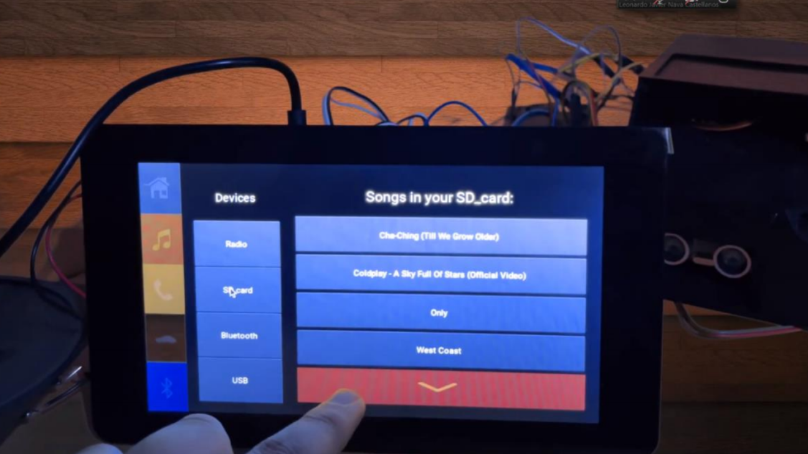

# CIECS - *Car Info Entretainment and Control System*

**CIECS** this system was created as a project for a college course, the project consisted in 
designing a Car Info Entertainment System that should be able to reproduce mp3 songs stored in
an SD Card. The system should also be able to display in some way the details of each song, 
such as: name of each mp3 file, the name of the song, artists, album, release date, sampling 
rate and digitalization type. Another system requirement was that the system should give the 
user the possibility to pause the song, play the next song and play the previous song.

Once the project was completed we were able to display a GUI in the official RaspberryPI 7"
display using kivy framework. We were also able to reproduce mp3 files and to control car luxuries
as shown in this **video:** [https://www.youtube.com/watch?v=LXd02VLev2I&t=316s] (please notice that
the video title is in spanish but the whole tecnical overview is in **English**).

For further details please refer to the **report** found at:
https://drive.google.com/file/d/1roVKvkTU1Aj1GDYk1zVPgRM2NIGOw_m0/view?usp=sharing

Developed by: **Jose Angel Del Angel Dominguez** and **Leonardo Javier Nava Castellanos**

## Final prototype

Here are some images showing the main functions of the project:

